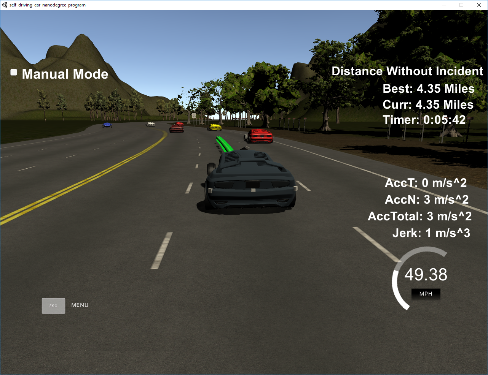
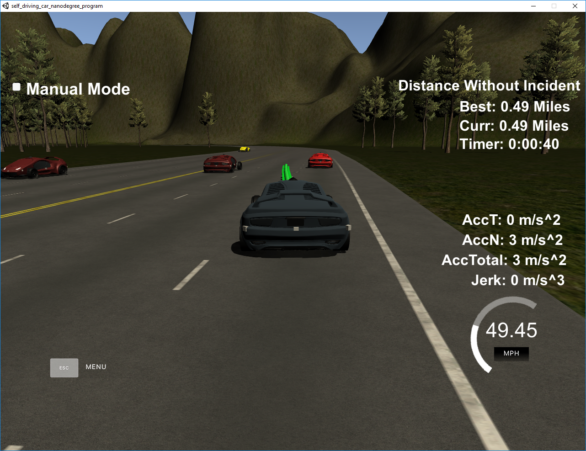

# CarND-Path-Planning-Project-P1
Udacity Self-Driving Car Nanodegree - Path Planning Project

## Introduction
The target of this project was to drive a car safely around a circular track which has a length of 4.32 miles. To be successful the car was not allowed to:
1. Collide with another car
2. Leave the right three lines
3. The car has to stay within its current line, except for reasonable overtaking maneuvers
4. Do not drive over 50mph
5. Do not make movements that have a too high acceleration or jerk

## Path planning
My submission code was able to drive the car safely around the track.

### The car is able to drive at least 4.32 miles without incident.
1. The car is able to drive for more that 4.32 miles without incident:

2. The car drives according to the speed limit

3. Max Acceleration and Jerk are not exceeded.

4. Car does not have collisions.

5. The car stays in its lane, except for the time between changing lanes.

6. The car is able to change lanes

## Reflection

The project's source code of the path planning algorithm goes from  [src/main.cpp](./src/main.cpp#L247) line 247 to line 430 and consists of three sections:

### Prediction [line 257 to line 296](./src/main.cpp#L257)
This section captures the ride-related environment of our car based on telemetry and sensor fusion data.
- In front of us is a vehicle that drives slower than we want to drive and that we want to overtake
- Is a car to the right of us, so we can not make a lane change to the right
- Is a car to the left, so we can not switch to the left lane

These questions are answered by calculating the lane of each other vehicle and the position at the end of the last plant trajectory. A car blocks a lane if the distance to our car is less than 30 meters ahead or behind us.

### Behavior [line 298 to line 325](./scr/main.cpp#L298)
In this section of the code, the speed is increased or decreased or it makes a lane change, as far as it is safe. To make the car more responsive, a 'speed_diff' is created that is used for speed changes when the trajectory is generated in the last part of the code.

### Trajectory [line 327 to line 428](./scr/main.cpp#L327)
This code does the calculation of the trajectory based on the speed and lane output from the behavior, car coordinates and past path points.

- First, the last two points of the previous trajectory or the car position if there are no previous trajectory is determindes in lines 336 to 360.
- Then three points at a far distance are calculated in lines 362 to 373.
- The coordinates are transformed (shift and rotation) to local car coordinates (lines 375 to 382).
- The spline calculation is executed in lines 385 and 386. 
- To smooth the trajectory, the previous trajectory points are copied to the new trajectory (lines 389 to 394). 
- The rest of the points is calculated by evaluating the spline and transforming the output coordinates to not local coordinates (lines 397 to 427). 
